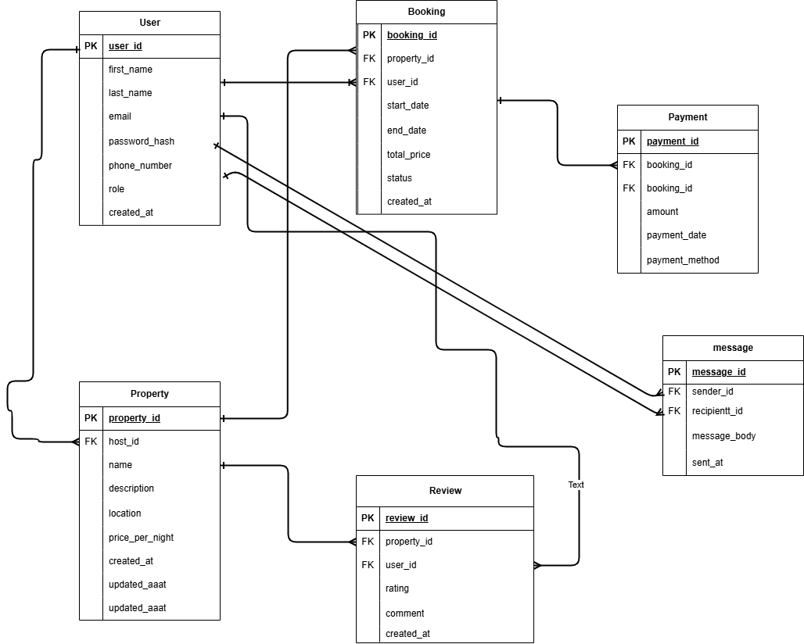

# Task 0: Entity-Relationship (ER) Diagram
**Project:** DataScape: Mastering Database Design  
**Repository:** alx-airbnb-database  
**Directory:** ERD/  
**File:** requirements.md  

---

## Objective
Create an Entity-Relationship Diagram (ERD) for the Airbnb database.  
The diagram identifies all entities, their attributes, and the relationships between them as defined in the project specification.

---

## Entities and Attributes

### User
- user_id (PK)  
- first_name  
- last_name  
- email  
- password_hash  
- phone_number  
- role  
- created_at  

### Property
- property_id (PK)  
- host_id (FK → User.user_id)  
- name  
- description  
- location  
- pricepernight  
- created_at  
- updated_at  

### Booking
- booking_id (PK)  
- property_id (FK → Property.property_id)  
- user_id (FK → User.user_id)  
- start_date  
- end_date  
- total_price  
- status  
- created_at  

### Payment
- payment_id (PK)  
- booking_id (FK → Booking.booking_id)  
- amount  
- payment_date  
- payment_method  

### Review
- review_id (PK)  
- property_id (FK → Property.property_id)  
- user_id (FK → User.user_id)  
- rating  
- comment  
- created_at  

### Message
- message_id (PK)  
- sender_id (FK → User.user_id)  
- recipient_id (FK → User.user_id)  
- message_body  
- sent_at  

---

## Relationships and Cardinalities

1. **User (1) → Property (N):** One user (host) can list many properties.  
2. **User (1) → Booking (N):** One user (guest) can make many bookings.  
3. **Property (1) → Booking (N):** One property can have many bookings.  
4. **Booking (1) → Payment (1):** Each booking has one corresponding payment record.  
5. **Property (1) → Review (N):** One property can have many reviews.  
6. **User (1) → Review (N):** One user can write many reviews.  
7. **User (1) → Message (N) [Sender]:** One user can send many messages.  
8. **User (1) → Message (N) [Recipient]:** One user can receive many messages.  

---

## ER Diagram (Text-Based)

